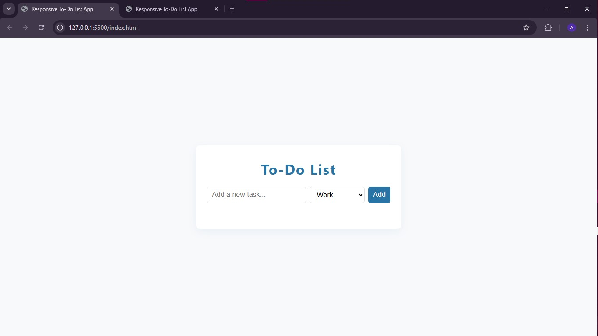

# To‑Do List Web App

A simple and responsive **To‑Do List** application built using **HTML**, **CSS**, and **JavaScript**.

## 🚀 Features
- Add, edit, delete tasks
- Mark tasks as completed
- Save tasks to browser local storage
- Simple animations for interactions
- Color‑coded categories

## 🛠 Tech Stack
- HTML5  
- CSS3  
- JavaScript (Local Storage API)  

## 📸 Screenshots

## 🔗 Live Demo
[View Live Site](https://shadow12sniper.github.io/to-do-list/)

## 📂 How to Use
1. Clone the repo:  
   `git clone https://github.com/yourusername/todo-app.git`
2. Open `index.html` in your browser.

---
